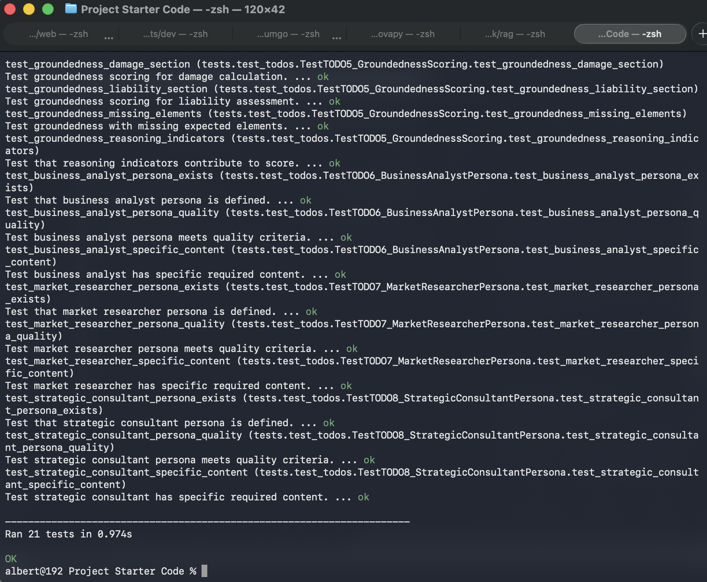
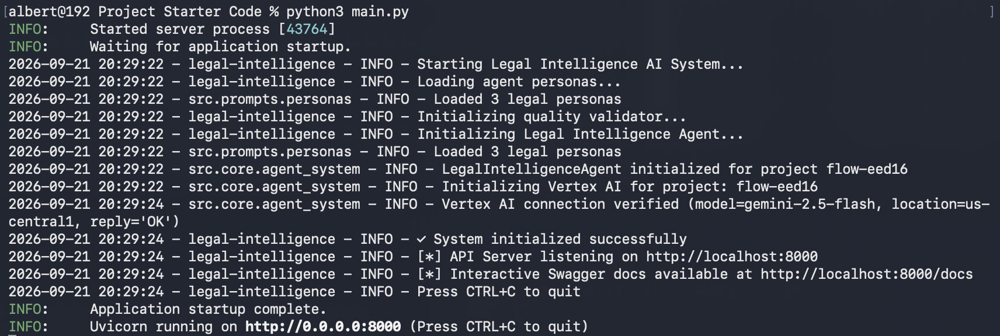
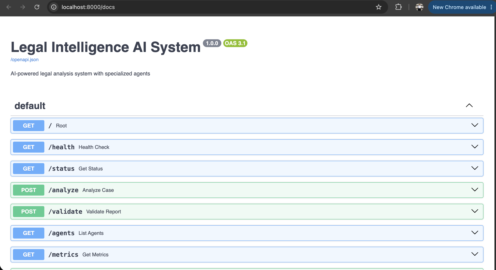
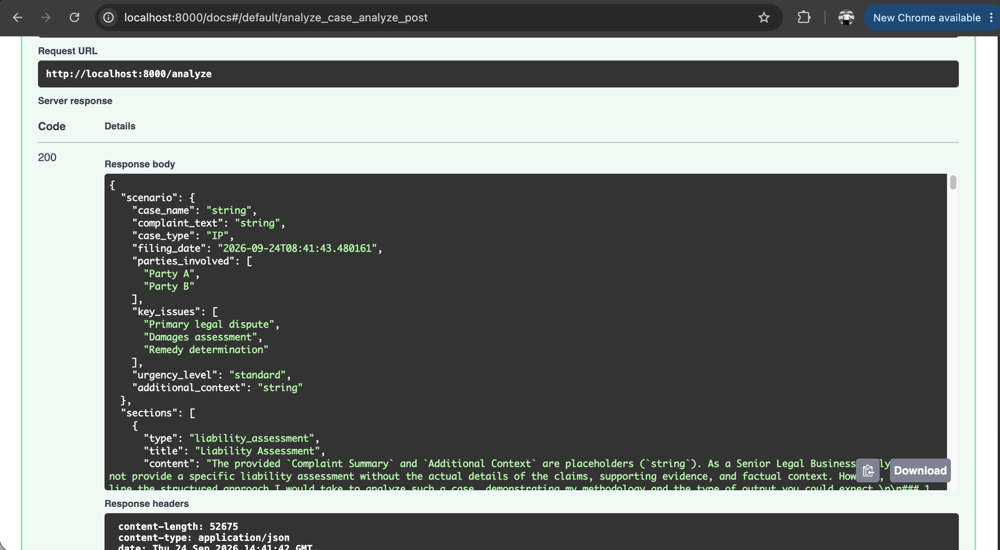

# Legal Intelligence AI System

A FastAPI service where specialized expert personas analyze a legal case on **Vertex AI** (`gemini-2.5-flash`) and write a six-section report. Every section is scored for quality before it is accepted.

---

## How it works

1. **Vertex AI client** (`src/core/agent_system.py`). It connects to Vertex AI through the `google-genai` SDK and verifies the connection with a one-word prompt at startup. If initialization fails it returns `False`, and the API answers 503 instead of crashing.
2. **Section generation** (`src/core/agent_system.py`). Each prompt combines a persona, chain-of-thought instructions, the two preceding sections and the case facts. Calls retry up to three times with exponential backoff, and every call records tokens, cost and latency.
3. **Report orchestration** (`src/core/agent_system.py`). The report has six sections: liability assessment, damage calculation, prior art analysis, competitive landscape, risk assessment and strategic recommendations. Sections that score below 0.7 are regenerated once with the validator's feedback, and the better draft is kept. If a section still fails, it becomes a labelled placeholder so the rest of the report survives.
4. **Quality validation** (`src/core/quality_validator.py`). Coherence is scored from paragraphs, logical connectors, structure markers and sentence depth. Groundedness is scored from section-specific legal keywords, reasoning indicators and expected elements. Completeness and structure are combined with both into an overall score.
5. **Expert personas** (`src/prompts/personas.py`):
   - **Business Analyst:** damages and financial modeling (Georgia-Pacific, entire market value, NPV/ROI).
   - **Market Researcher:** prior art, patent landscapes and competitive intelligence.
   - **Strategic Consultant:** risk matrices, settlement and licensing strategy, and executive recommendations.

## Project structure

```
main.py                     FastAPI app: /analyze, /validate, /agents, /metrics, /status, /health
src/
├── core/
│   ├── agent_system.py     Vertex AI client, section generation, report orchestration
│   └── quality_validator.py Coherence, groundedness, completeness and structure scoring
├── prompts/personas.py     Business analyst, market researcher and strategic consultant personas
├── models/legal_models.py  Pydantic models for scenarios, sections and reports
└── utils/logger.py
tests/test_legal_intelligence.py  21 unit tests (mocked, no live API calls)
test_scenarios.json         Sample legal cases
final_report.md             Full run: test output, API responses and a generated report
```

## Screenshots

### Unit tests
All 21 tests pass without calling Vertex AI.



### Server startup
The service loads the three personas, verifies the Vertex AI connection (`gemini-2.5-flash`, `us-central1`) and starts listening on port 8000.



### API documentation
Swagger UI lists the analysis, validation and operational endpoints.



### Legal analysis
`POST /analyze` returns the scenario and the generated report sections, starting with the liability assessment.



## Running it

```bash
pip install -r requirements.txt
cp .env.example .env                     # set PROJECT_ID (a project with the Vertex AI API enabled)
gcloud auth application-default login    # or set GOOGLE_APPLICATION_CREDENTIALS
python test_setup.py                     # checks the Google Cloud configuration
python main.py                           # http://localhost:8000/docs
```

Analyze a case:

```bash
curl -X POST "http://localhost:8000/analyze" \
  -H "Content-Type: application/json" \
  -d '{
    "scenario": "Tech company accused of patent infringement on mobile payment processing system",
    "context": "Defendant has prior art from 2015, plaintiff filed patent in 2018"
  }'
```

A six-section report takes 80 to 100 seconds and costs about $0.04 with `gemini-2.5-flash`. `GET /metrics` shows cumulative tokens, success rate and average section latency.

## Tests

```bash
python tests/test_legal_intelligence.py
```

Run the tests without `PROJECT_ID` exported in the shell: `test_initialization_failure_handling` expects initialization to fail when no project is configured.
