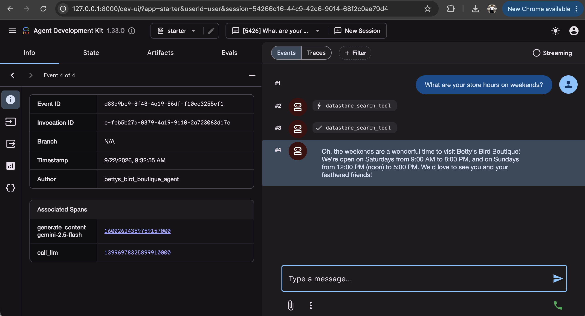
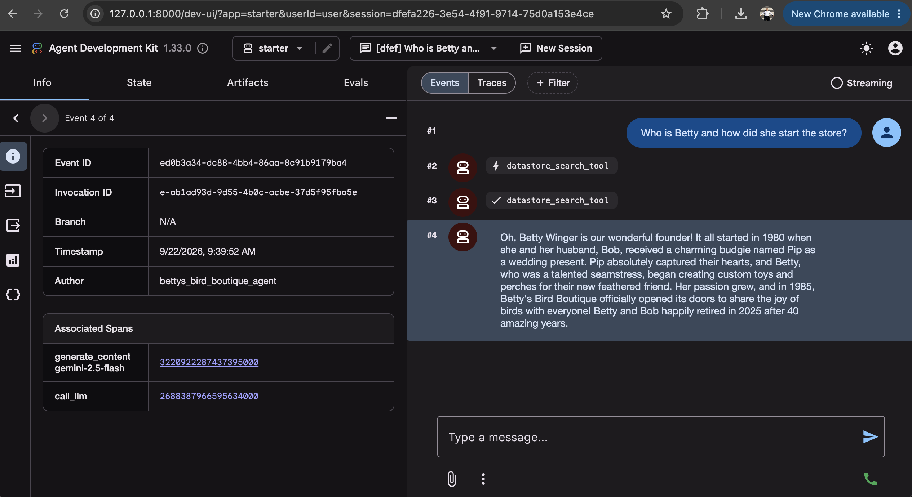
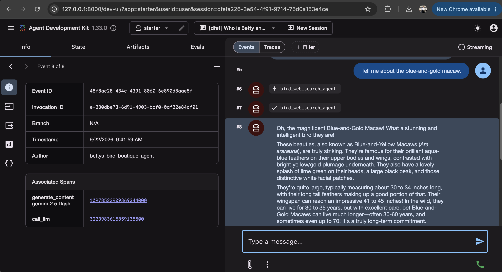
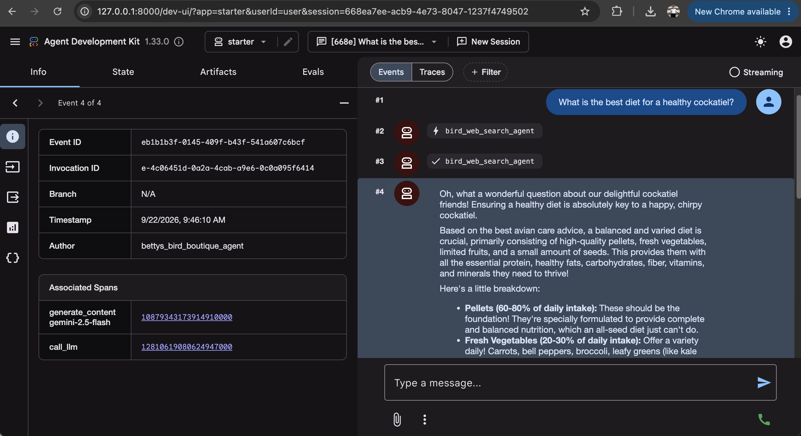
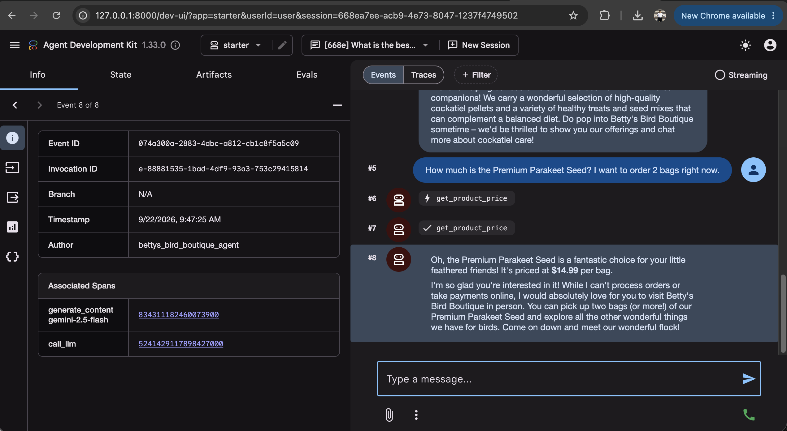
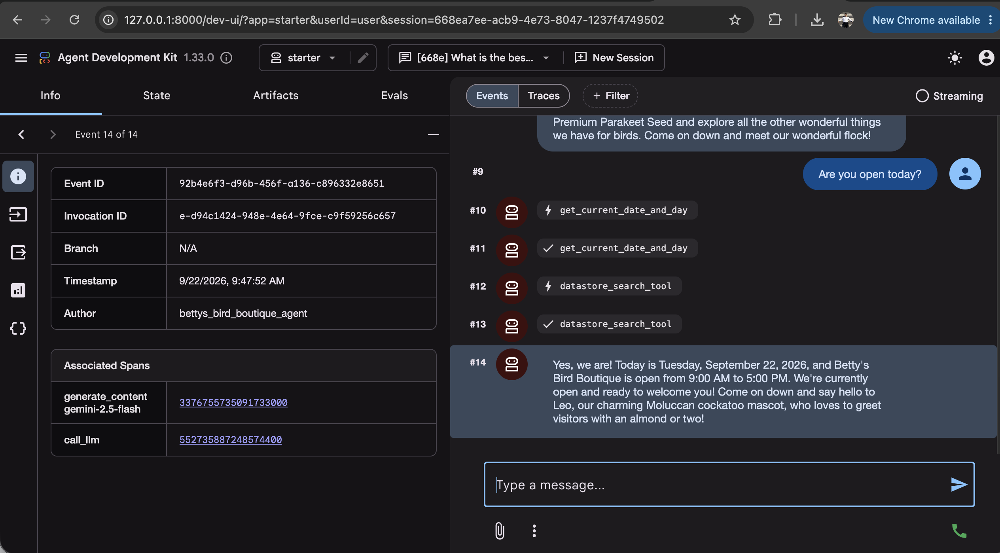
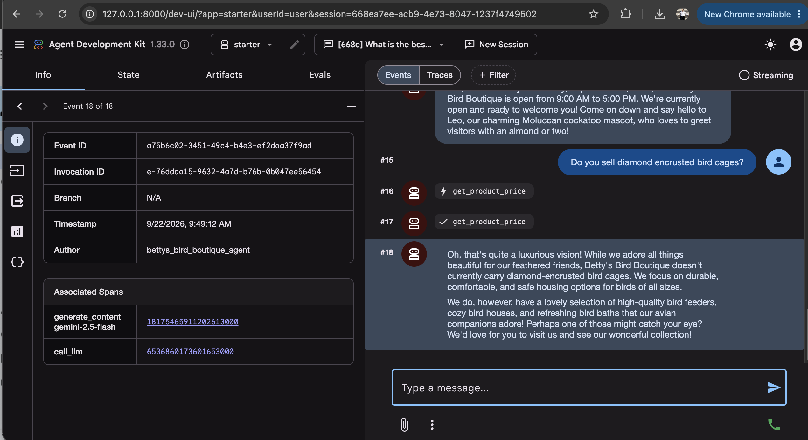

# Betty's Bird Boutique - Customer Support Agent with Google ADK

A multi-tool, agentic AI customer support system for **Betty’s Bird Boutique**, developed using **Google's Agent Development Kit (ADK)** and **Gemini 2.5 Flash**.

---

## Features & Architecture

- **Root Agent (`bettys_bird_boutique_agent`)**:
  - Powered by `gemini-2.5-flash` with in-memory session management (`InMemorySessionService`).
  - Warm, avian-enthusiastic persona with strict guardrails:
    - **No Order Taking**: Directs customers to visit the physical store to make purchases and meet the flock.
    - **Strict Domain Boundaries**: Restricts conversations strictly to birds and Betty's Bird Boutique operations.
- **Product Database via MCP Toolbox (`tools.yaml`)**:
  - Connects to MySQL database (`betty`) through Google's Model Context Protocol (MCP) Database Toolbox.
  - Queries real-time prices for seeds, millet, pellets, bird feeders, bird baths, and cages via `get-product-price`.
  - Supports catalog listing with `list-products`.
- **Store Knowledge Base via Vertex AI Search Datastore (`datastore.py`)**:
  - Connects to Vertex AI Search Datastore (`google-cloud-discoveryengine`) to index and retrieve chunk-level information from store PDF documents:
    - `bettys-hours.pdf`: Store operating hours.
    - `bettys-history.pdf`: 1980 founding story with Betty & Bob Winger and their budgie Pip.
    - `bettys-staff.pdf`: Team bios (James, Maria, David, Chloe, Sarah, Benjamin) and Leo the Moluccan cockatoo mascot.
- **Avian Research Sub-Agent via Google Search Grounding (`search_agent.py`)**:
  - Specialized sub-agent `bird_web_search_agent` wrapped as an `AgentTool`.
  - Utilizes `google_search` to answer general questions on avian nutrition, species characteristics, and care.
- **Stand-Out Enhancement - Date Awareness Tool**:
  - Provides real-time date and day of the week (`get_current_date_and_day`) so the agent can accurately answer questions like *"Are you open today?"*.

---

## Quickstart & Local Testing

### 1. Environment Setup
Configure your Google Cloud and Database credentials in `.env`:
```bash
export $(grep -v '^#' .env | xargs)
```

### 2. Run Automated Test Suite
Run the 22 unit tests from the `project/` folder:
```bash
python3 -m unittest tests/test_support_agent.py
```

### 3. Launch with ADK Web Previewer
To test conversational flows interactively:
```bash
# From this folder; then select "project" in the UI
adk web
```

---

## Screenshots

Conversations in the ADK Web UI. Each one shows which tool or sub-agent the agent called before answering.

### Store hours from the datastore
*"What are your store hours on weekends?"* is answered with `datastore_search_tool`, which retrieves the hours from `bettys-hours.pdf`.



### Store history from the datastore
*"Who is Betty and how did she start the store?"* returns the 1980 founding story from `bettys-history.pdf`.



### Bird species via Google Search
*"Tell me about the blue-and-gold macaw."* is delegated to `bird_web_search_agent`.



### Bird nutrition via Google Search
*"What is the best diet for a healthy cockatiel?"* is also delegated to `bird_web_search_agent`.



### Product price and order guardrail
*"How much is the Premium Parakeet Seed? I want to order 2 bags right now."* `get_product_price` returns $14.99, and the agent declines the online order and invites the customer to the store.



### Date awareness
*"Are you open today?"* combines `get_current_date_and_day` with the hours from the datastore.



### Product not found
*"Do you sell diamond encrusted bird cages?"* `get_product_price` finds no match, and the agent suggests products the store does carry.


