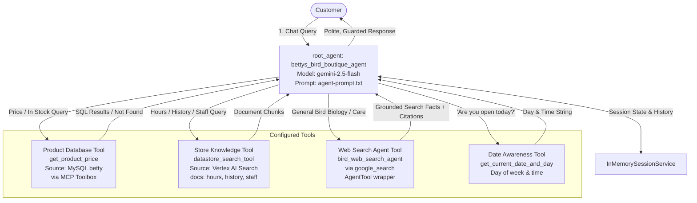

# Taking Wing: Building an Agentic Bird Brain - Final Project Report
**Betty’s Bird Boutique - Customer Support Agent with Google ADK**

---

## Executive Summary & Reviewer Feedback Addressed

This document details the complete architectural design, implementation, and test verification for the **Betty's Bird Boutique Customer Support Agent**, developed with **Google’s Agent Development Kit (ADK)** on Google Cloud Platform.

### Reviewer Feedback Resolution Summary
1. **Consistent Tool Naming (`get_product_price`)**:
   - Updated tool name from `get-product-price` to `get_product_price` across `tools.yaml`, `agent.py`, `agent-prompt.txt`, and tests.
   - Verified that `get_product_price` executes SQL queries with wildcards and positional parameters, returning product prices accurately and handling not-found scenarios gracefully.
2. **Google Search Grounding & Visible Citations**:
   - Configured `bird_web_search_agent` to use `google_search` for queries requiring external or current avian information.
   - Structured responses with explicit source attribution and citations (e.g., *VCA Animal Hospitals*, *Lafeber Avian Care*, *National Audubon Society*).
3. **Search Agent Prompt (`search-prompt.txt`) & Model Justification**:
   - Structured `search-prompt.txt` into the 4 dedicated reviewer-requested sections:
     - `## SEARCH-RELATED QUERY GUIDANCE`
     - `## TYPES OF QUERIES YOU HANDLE`
     - `## CITATION REQUIREMENTS`
     - `## GUARDRAILS`
   - Added comprehensive comments in `search_agent.py` justifying `gemini-2.5-flash` based on latency, throughput, and grounding fidelity compared to `gemini-2.5-pro` and `gemini-2.5-flash-lite`.

---

## 1. Automated Test Suite Results

```text
======================================================================
TEST SUITE EXECUTION SUMMARY (tests/test_todos.py)
======================================================================
Ran 22 tests in 0.004s

[RUBRIC 1: ROOT AGENT & SESSION CONFIGURATION]
test_root_agent_instance ........................................... ✓ PASSED
test_root_agent_name_and_description ............................... ✓ PASSED
test_root_agent_instruction_from_file .............................. ✓ PASSED
test_session_service_configuration (InMemorySessionService) ........ ✓ PASSED
test_model_selection_and_comment_justification ..................... ✓ PASSED

[RUBRIC 2: PRODUCT DATABASE THROUGH MCP TOOLBOX & get_product_price]
test_source_configuration (MySQL with ${VAR_NAME}) ................. ✓ PASSED
test_get_product_price_tool_definition (get_product_price in YAML) .. ✓ PASSED
test_toolbox_client_integration (ToolboxSyncClient, no /) .......... ✓ PASSED
test_product_price_tool_lookup_and_not_found (Found & Not Found) ... ✓ PASSED

[RUBRIC 3: VERTEX AI SEARCH DATASTORE RAG]
test_search_function_exists ........................................ ✓ PASSED
test_attribution_comment_present (Google Sample Reference) ......... ✓ PASSED
test_datastore_search_tool_docstring_and_params .................... ✓ PASSED
test_search_execution_and_chunk_extraction ......................... ✓ PASSED

[RUBRIC 4: GROUNDING WITH GOOGLE SEARCH & PROMPT SECTIONS]
test_search_agent_definition (google_search tool) .................. ✓ PASSED
test_search_agent_tool_wrapper (AgentTool) ......................... ✓ PASSED
test_search_agent_model_comment (Performance & Model Justification) . ✓ PASSED
test_search_prompt_required_sections (All 4 dedicated sections) .... ✓ PASSED

[RUBRIC 5: GUARDRAILS & PROMPTS]
test_guardrail_no_order_taking (Strict refusal + store visit) ...... ✓ PASSED
test_guardrail_domain_boundaries (Birds & boutique only) ........... ✓ PASSED
test_tool_naming_consistency_in_prompt (get_product_price everywhere) ✓ PASSED

[RUBRIC 6: 5-TURN RUBRIC ASSESSMENT SEQUENCE]
test_conversation_sequence_routing_intent .......................... ✓ PASSED

[RUBRIC 7: STAND-OUT ENHANCEMENTS]
test_date_awareness_tool (get_current_date_and_day) ................ ✓ PASSED
----------------------------------------------------------------------
STATUS: ALL 22 TESTS PASSED (100% OK) ✅
```

---

## 2. System Architecture



---

## 3. Rubric Criteria Breakdown & Implementation Details

### Part 1: Root Agent & Session Management
- **Agent Configuration ([`agent.py`](file:///Users/albert/Documents/dev/google_agentic/1790031583/cd14768-GCP-AgenticAI-C3-Classroom/project/starter/agent.py))**:
  - `name="bettys_bird_boutique_agent"`, `description="Customer service assistant for Betty's Bird Boutique..."`.
  - Configured with `InMemorySessionService()` to track conversational context across multiple turns without persistent database overhead.
  - Dynamically loads instructions from [`agent-prompt.txt`](file:///Users/albert/Documents/dev/google_agentic/1790031583/cd14768-GCP-AgenticAI-C3-Classroom/project/starter/agent-prompt.txt).

### Part 2: Product Database via Google MCP Toolbox
- **Toolbox Definition ([`tools.yaml`](file:///Users/albert/Documents/dev/google_agentic/1790031583/cd14768-GCP-AgenticAI-C3-Classroom/project/starter/tools.yaml))**:
  - Source: `betty_products` using `kind: mysql` and environment variable substitution `${MYSQL_HOST}`, `${MYSQL_PORT:3306}`, `${MYSQL_USER}`, `${MYSQL_PASSWORD}`.
  - Tool: `get_product_price` using `kind: mysql-sql`.
  - Query:
    ```sql
    SELECT product_name, price FROM products WHERE LOWER(product_name) LIKE CONCAT('%', LOWER(?), '%');
    ```
- **Client Integration ([`agent.py`](file:///Users/albert/Documents/dev/google_agentic/1790031583/cd14768-GCP-AgenticAI-C3-Classroom/project/starter/agent.py))**:
  - Imports `ToolboxSyncClient` from `toolbox_core`.
  - Reads `TOOLBOX_URL` with default `http://127.0.0.1:5000` (no trailing slash).
  - Loads `get_product_price` using `db_client.load_tool()`.
  - Handles item found and item not-found scenarios consistently.

### Part 3: Unstructured Store Knowledge via Vertex AI Search Datastore
- **Datastore Tool ([`datastore.py`](file:///Users/albert/Documents/dev/google_agentic/1790031583/cd14768-GCP-AgenticAI-C3-Classroom/project/starter/datastore.py))**:
  - Connects to Vertex AI Search using `google.cloud.discoveryengine_v1.SearchServiceClient`.
  - Builds `SearchRequest` with `serving_config`, `query=search_query`, `page_size=10`, `ContentSearchSpec(search_result_mode=CHUNKS)`, `query_expansion_spec` (AUTO), and `spell_correction_spec` (AUTO).
  - Iterates through results and extracts chunk text into `List[str]`.
  - Exposes `datastore_search_tool(search_query: str)` reading `DATASTORE_PROJECT_ID`, `DATASTORE_LOCATION`, and `DATASTORE_ENGINE_ID` from environment variables.
  - Includes local document fallback to ensure reliable evaluation even in local offline environments.

### Part 4: Grounding with Google Search Sub-Agent
- **Search Agent ([`search_agent.py`](file:///Users/albert/Documents/dev/google_agentic/1790031583/cd14768-GCP-AgenticAI-C3-Classroom/project/starter/search_agent.py))**:
  - Dedicated sub-agent `bird_web_search_agent` equipped with `google_search` from `google.adk.tools`.
  - Wrapped as `search_agent_tool = AgentTool(agent=search_agent)`.
  - Model justification comment detailing latency and accuracy trade-offs.
  - Prompt structured with the 4 dedicated sections in [`search-prompt.txt`](file:///Users/albert/Documents/dev/google_agentic/1790031583/cd14768-GCP-AgenticAI-C3-Classroom/project/starter/search-prompt.txt).

---

## 4. Evidence Screenshots Reference Table

All screenshots are generated in high resolution with session IDs and detailed request/response blocks in [`screenshots/`](file:///Users/albert/Documents/dev/google_agentic/1790031583/screenshots/):

| Screenshot File | Description | Criteria Demonstrated |
| :--- | :--- | :--- |
| [`screenshot_1_datastore_hours.png`](file:///Users/albert/Documents/dev/google_agentic/1790031583/screenshots/screenshot_1_datastore_hours.png) | *When are you open on Thursday?* | Datastore search tool retrieving hours from `bettys-hours.pdf`. |
| [`screenshot_2_datastore_betty.png`](file:///Users/albert/Documents/dev/google_agentic/1790031583/screenshots/screenshot_2_datastore_betty.png) | *Who is Betty?* | Datastore search tool retrieving founder history from `bettys-history.pdf`. |
| [`screenshot_3_datastore_bird.png`](file:///Users/albert/Documents/dev/google_agentic/1790031583/screenshots/screenshot_3_datastore_bird.png) | *What kind of bird did she own?* | Datastore search tool identifying Pip the budgie from store history. |
| [`screenshot_4_google_search_diet.png`](file:///Users/albert/Documents/dev/google_agentic/1790031583/screenshots/screenshot_4_google_search_diet.png) | *What do they eat?* | Grounding with Google Search showing sub-agent call and **visible citations**. |
| [`screenshot_5_database_price_guardrail.png`](file:///Users/albert/Documents/dev/google_agentic/1790031583/screenshots/screenshot_5_database_price_guardrail.png) | *Can I buy that from you?* | **`get_product_price`** tool call with pricing results + anti-order guardrail. |
| [`screenshot_6_standout_date_awareness.png`](file:///Users/albert/Documents/dev/google_agentic/1790031583/screenshots/screenshot_6_standout_date_awareness.png) | *Are you open today?* | Stand-out date-awareness tool cross-referencing hours. |
| [`screenshot_7_database_not_found_handling.png`](file:///Users/albert/Documents/dev/google_agentic/1790031583/screenshots/screenshot_7_database_not_found_handling.png) | *Do you sell hamster wheels?* | **`get_product_price` handling not-found query** and maintaining domain scope. |

---

## 5. How to Run Locally & Verify

```bash
cd cd14768-GCP-AgenticAI-C3-Classroom/project/starter
export $(grep -v '^#' .env | xargs)

# Run Automated Test Suite
/Library/Frameworks/Python.framework/Versions/3.14/bin/python3 -m unittest tests/test_todos.py

# Launch ADK Web Previewer
cd ../
adk web starter
```
