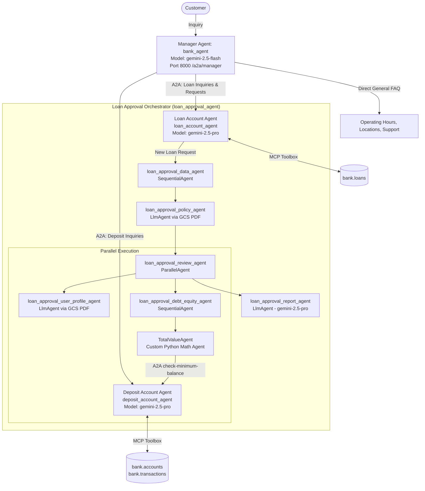
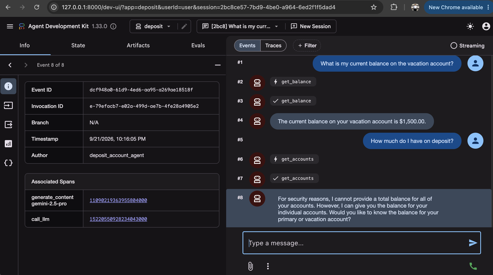
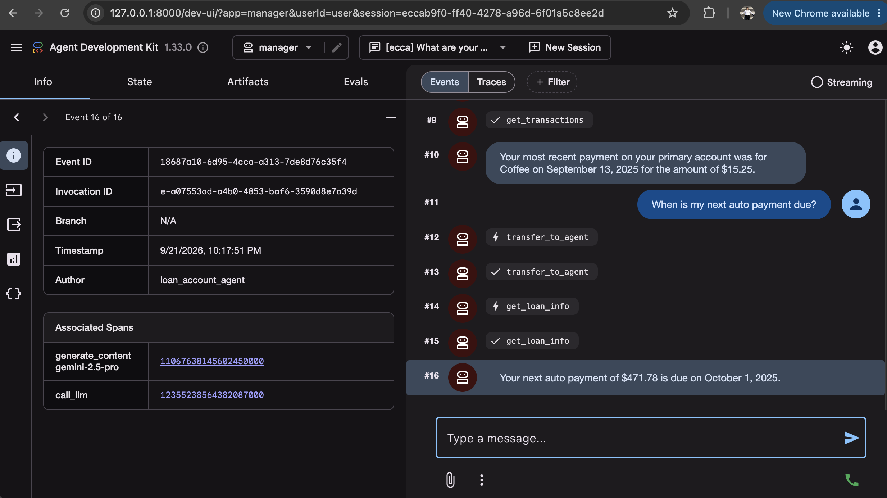
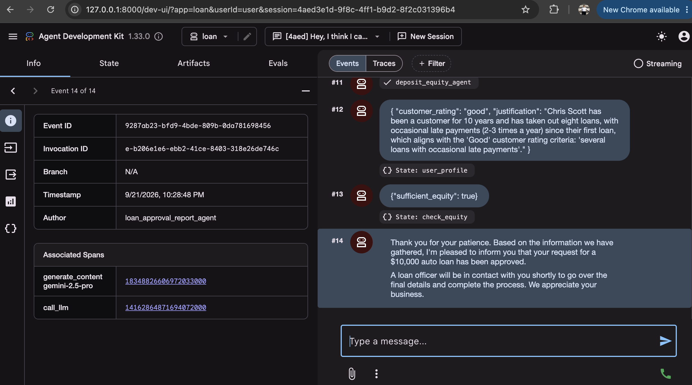
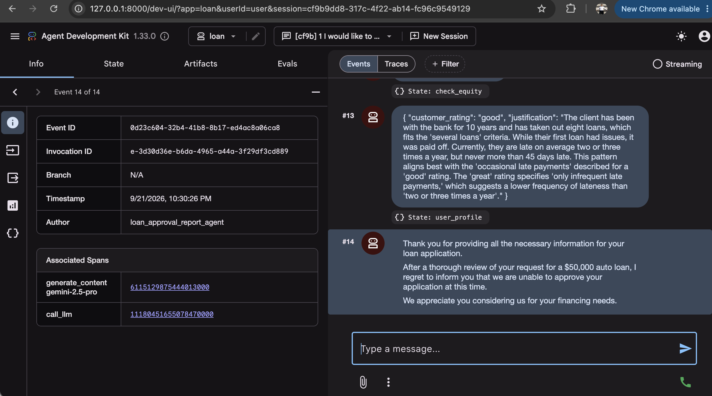
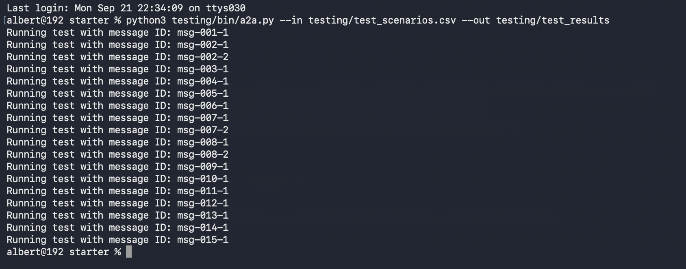
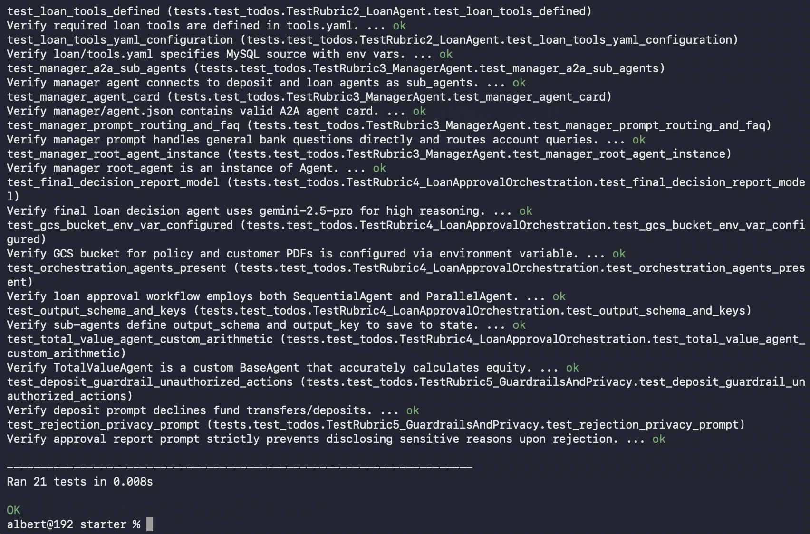

# Multi-Agent Banking Intelligence System

A multi-agent banking prototype built with **Google's Agent Development Kit (ADK)** and the **Agent-to-Agent (A2A)** protocol. A front-desk manager agent routes customers to isolated deposit and loan agents, and new loan requests go through a deterministic approval pipeline.

The code lives in [`project/`](project). Setup, environment variables and run commands are in [`project/README.md`](project/README.md), and the executive report is in [`project/final_report.md`](project/final_report.md).

---

## System Architecture

The system segregates banking data and workflows across three independent agents connected via A2A:

---

## Screenshots

### Deposit agent: balance lookup and total-balance guardrail
`get_balance` returns the vacation account balance. When asked for the total on deposit, the agent calls `get_accounts` but refuses to add the balances together.

### Manager agent: routing between deposit and loan agents
The manager answers a transaction question through the deposit agent, then uses `transfer_to_agent` to hand an auto-payment question to the loan agent, which calls `get_loan_info`.

### Loan approval: approved request
The pipeline writes `user_profile` and `check_equity` to state, and `loan_approval_report_agent` approves a $10,000 auto loan.

### Loan approval: rejected request
A $50,000 request is declined. The customer only gets a respectful notice, with no credit rating or internal ratios disclosed.

### A2A batch evaluation
`testing/bin/a2a.py` sends the 18 scenario messages in `test_scenarios.csv` to the manager over A2A.

### Unit tests
All 21 unit tests pass.

---

## Security & Privacy Guardrails

1. **Total Balance Prohibition**: In compliance with banking security standards, the deposit agent strictly refuses to output total aggregate balances across accounts, mitigating unauthorized asset reconnaissance (`msg-003-1`).
2. **Rejection Privacy Enforcement**: When an application is declined (`msg-007-2`), the loan approval pipeline generates a respectful, general notification without disclosing proprietary credit ratings, debt ratios, or internal bank formulas.
3. **Deterministic Math**: The custom `TotalValueAgent` computes required minimum deposit balances using Python floating-point arithmetic, entirely eliminating LLM hallucination risks during financial underwriting.
