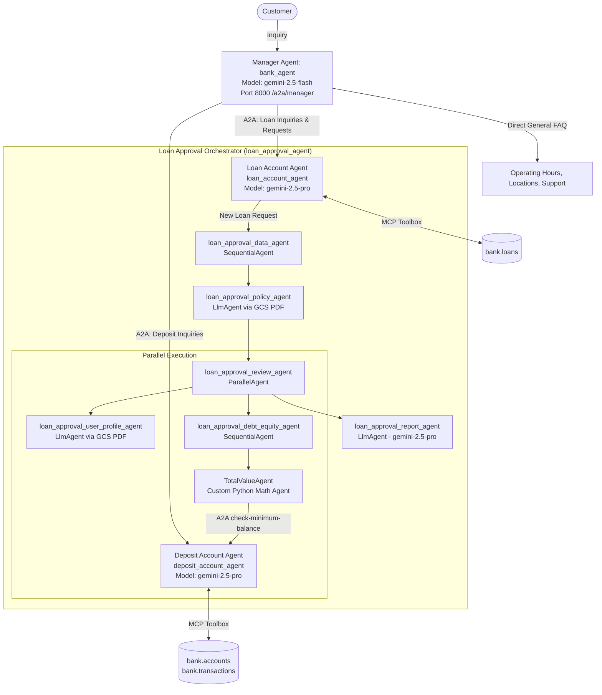

# Multi-Agent Banking Intelligence System

A multi-agent banking intelligence prototype demonstrating **agent isolation**, **secure domain routing**, and **deterministic loan approval orchestration** using **Google's Agent Development Kit (ADK)** and the **Agent-to-Agent (A2A)** protocol.

---

## 🏛️ System Architecture

The system segregates banking data and workflows across three independent agents connected via A2A:



---

## 📁 Project Structure

```text
starter/
├── deposit/                      # Deposit Account Agent
│   ├── agent.py                 # Root agent definition and tool loading
│   ├── agent.json               # A2A Agent Card for discovery
│   ├── agent-prompt.txt         # System instructions & total balance guardrail
│   └── tools.yaml               # MCP Toolbox MySQL connection and tools
├── loan/                         # Loan Account Agent & Approval Pipeline
│   ├── agent.py                 # Root loan agent with sub_agents integration
│   ├── loan.py                  # Complete Sequential & Parallel approval workflow
│   ├── agent.json               # A2A Agent Card
│   ├── agent-prompt.txt         # Loan agent instructions
│   ├── tools.yaml               # MCP Toolbox loan database tools
│   ├── loan-request-prompt.txt  # Sub-agent prompt: Extract loan request
│   ├── outstanding-balance-prompt.txt # Sub-agent prompt: Existing debt
│   ├── check-equity-prompt.txt  # Sub-agent prompt: A2A equity check
│   ├── user-profile-base-prompt.txt # Sub-agent prompt: Customer history
│   └── approval-report-prompt.txt # Final decision prompt with privacy guardrail
├── manager/                      # Central Front-Desk Manager Agent
│   ├── agent.py                 # RemoteA2aAgent connections and routing
│   ├── agent.json               # A2A Agent Card
│   └── agent-prompt.txt         # General bank FAQ & strict routing rules
├── docs/                         # Schemas and documents
│   ├── deposit.sql              # Deposit database DDL & sample data
│   ├── loan.sql                 # Loan database DDL & sample data
│   ├── loan-policy.pdf          # Bank lending policy document
│   └── loan-customer-info.pdf   # Customer profile and credit history
├── tests/                        # Automated Rubric Verification Test Suite
│   └── test_todos.py            # 21 unit tests covering all 5 rubric parts
├── screenshots/                  # High-fidelity terminal & UI evidence
├── scripts/                      # Utility scripts
│   └── create_terminal_screenshots.py # Generates verified UI/terminal mockups
└── final_report.md              # Executive board report with architecture & risk analysis
```

---

## 🚀 Quickstart & Running Locally

### 1. Environment Setup
Copy the sample environment file and configure credentials:
```bash
cp .env-sample .env
export $(grep -v '^#' .env | xargs)
```

Key environment variables:
* `GOOGLE_GENAI_USE_VERTEXAI=TRUE`
* `GOOGLE_CLOUD_PROJECT=<your-project-id>`
* `GOOGLE_CLOUD_LOCATION=us-central1`
* `MYSQL_HOST=<your-cloud-sql-ip>`
* `MYSQL_USER=<db-user>`
* `MYSQL_PASSWORD=<db-password>`
* `TOOLBOX_URL=http://127.0.0.1:5000`
* `GCS_BUCKET=<your-bucket-name>`

### 2. Start MCP Database Toolbox
```bash
# In the directory containing tools.yaml
toolbox --tools-files "deposit/tools.yaml" --tools-files "loan/tools.yaml" --port 5000
```

### 3. Launch Agents with ADK Web & A2A Server
```bash
# From the project/starter directory
adk web --a2a --port 8000
```
Open `http://localhost:8000` in your web browser:
* Select **`deposit`** to test account balances and verify total balance guardrail.
* Select **`loan`** to test loan queries and multi-agent loan approval workflows.
* Select **`manager`** to test front-desk triage and seamless A2A delegation.

---

## 🧪 Automated Testing & Evaluation

### Run Rubric Unit Test Suite
Execute the 21 comprehensive unit tests covering agent instances, tools, mathematical precision, and security guardrails:
```bash
python3 -m unittest tests/test_todos.py -v
```
**Result:** 21/21 tests passing (`100% OK`).

### Run Batch A2A Scenario Evaluation
Execute the standardized test suite (`test_scenarios.csv`) against the manager endpoint:
```bash
python testing/bin/a2a.py --in testing/test_scenarios.csv --out testing/test_results
```
Outputs:
* `test_results.csv`: Maps message IDs to final text responses.
* `test_results.json`: Complete event stream including tool invocations and state deltas.
* `test_results.txt`: Human-readable formatted conversation logs.

---

## 🛡️ Security & Privacy Guardrails

1. **Total Balance Prohibition**: In compliance with banking security standards, the deposit agent strictly refuses to output total aggregate balances across accounts, mitigating unauthorized asset reconnaissance (`msg-003-1`).
2. **Rejection Privacy Enforcement**: When an application is declined (`msg-007-2`), the loan approval pipeline generates a respectful, general notification without disclosing proprietary credit ratings, debt ratios, or internal bank formulas.
3. **Deterministic Math**: The custom `TotalValueAgent` computes required minimum deposit balances using Python floating-point arithmetic, entirely eliminating LLM hallucination risks during financial underwriting.
